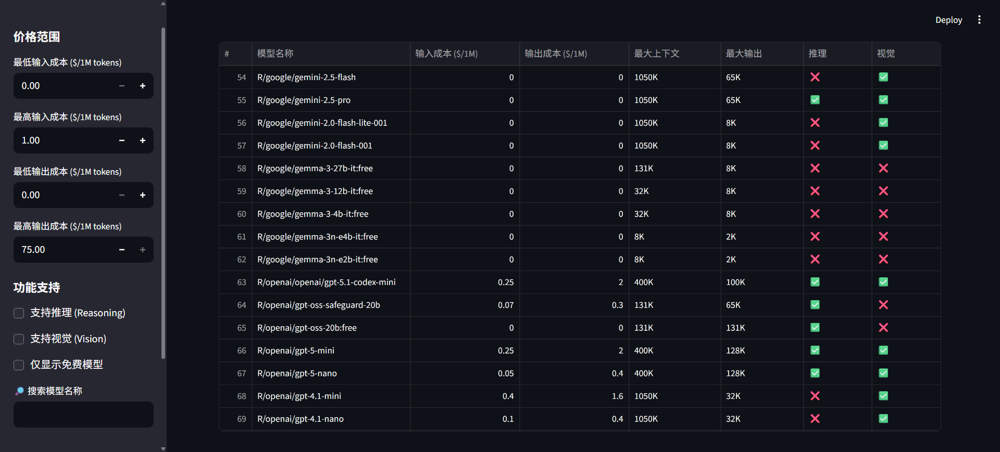

# AI Models Dashboard

一个基于Streamlit的AI模型信息仪表板，用于查看和筛选AI模型配置信息。


## 功能特性

### 📊 数据展示
- 以表格形式展示AI模型信息
- 支持输入/输出成本、上下文长度、特性支持等
- 自动编号显示（从1开始）

### 🔍 筛选功能
- **价格范围筛选**：按输入/输出成本筛选模型
- **功能筛选**：按是否支持推理(Reasoning)和视觉(Vision)筛选
- **免费模型**：一键显示完全免费的模型
- **关键词搜索**：按模型名称搜索

### 📤 导入配置
- 支持上传 LiteLLM 的自定义 config.yaml 配置文件
- 自动处理并转换为标准格式
- 手动更新仪表板数据

### 🔄 CCR 模型同步
- 一键同步 LiteLLM 配置到 Claude Code Router
- 自动提取 `litellmconfig.yaml` 中的所有模型名称
- 更新 `config.json` 中 lite provider 的模型列表
- 实时显示同步结果和详细日志

## 安装说明

推荐使用 Docker Compose 部署，详情请参见 [Docker Compose 部署](#docker-compose-部署-推荐)

### 前提条件
- Python 3.7 或更高版本 (如果选择非 Docker 部署)

### 安装依赖 (如果选择非 Docker 部署)

```bash
pip install streamlit pyyaml pandas
```

## 使用方法

推荐使用 Docker Compose 部署，详情请参见 [Docker Compose 部署](#docker-compose-部署-推荐)

### 启动应用 (如果选择非 Docker 部署)

```bash
streamlit run app.py
```

访问显示的URL（通常是 http://localhost:8501）

### 处理YAML文件

手动处理YAML文件：

```bash
# 使用默认文件
python process_yaml.py

# 指定输入和输出文件
python process_yaml.py path_to_you_input.yaml processed_models.yaml
```

### 导入新配置

1. 点击左侧边栏的 **"导入配置"** 按钮
2. 选择YAML配置文件上传
3. 点击 **"⚙️ 开始处理"**
4. 数据将自动更新到仪表板
5. 如需手动刷新，点击 **"🔄 刷新数据"**

### 同步 CCR 模型

在应用界面中：
1. 点击左侧边栏底部的 **"🔄 Sync CCR Models"** 按钮
2. 系统将自动从 `litellmconfig.yaml` 提取模型名称
3. 更新到 `config.json` 的 lite provider 配置中
4. 查看同步结果和详细日志

使用命令行：
```bash
# 使用默认路径
python sync_ccr_models.py

# 指定自定义路径
python sync_ccr_models.py <yaml文件路径> <json文件路径>
```

### 配置默认路径

默认路径定义在 [`config_paths.py`](config_paths.py) 中：

- `LITELLM_CONFIG_PATH`：LiteLLM 配置 YAML 文件路径（默认：`C:\Users\gotmo\litellmconfig.yaml`）
- `CLAUDE_CONFIG_PATH`：Claude Code Router 配置 JSON 文件路径（默认：`C:\Users\gotmo\.claude-code-router\config.json`）

**修改方法**：
- **本地环境**：直接编辑 [`config_paths.py`](config_paths.py) 文件更改路径
- **Docker 环境**：编辑 [`config_paths_docker.py`](config_paths_docker.py) 文件更改路径，并确保 [`docker-compose.yml`](docker-compose.yml) 中的卷映射正确

命令行参数将覆盖这些默认值。

### Docker 环境配置

在 Docker 环境中运行时，需要确保以下文件路径正确映射：

1. **LiteLLM 配置文件**：在 [`docker-compose.yml`](docker-compose.yml) 中映射实际的 litellmconfig.yaml 文件
2. **Claude Code Router 配置文件**：在 [`docker-compose.yml`](docker-compose.yml) 中映射实际的 config.json 文件
3. **配置路径文件**：使用 [`config_paths_docker.py`](config_paths_docker.py) 定义容器内的路径

示例 Docker 卷映射：
```yaml
volumes:
  - ./litellmconfig.yaml:/app/litellmconfig.yaml
  - C:\Users\gotmo\.claude-code-router\config.json:/app/claude_config.json
  - D:\Code\LiteLLM_OpenWebUI_Docker\litellmconfig.yaml:/app/real_litellmconfig.yaml
```

## 数据格式

### 输入YAML格式

```yaml
model_list:
  - model_name: "模型名称"
    model_info:
      input_cost_per_token: 0.0001
      output_cost_per_token: 0.0002
      max_tokens: 128000
      max_output_tokens: 4096
      supports_reasoning: true
      supports_vision: false
```

### 输出显示字段

- **模型名称**：模型标识
- **输入成本 ($/1M)**：每100万token的输入价格
- **输出成本 ($/1M)**：每100万token的输出价格
- **最大上下文**：模型支持的最大输入长度
- **最大输出**：模型支持的最大输出长度
- **推理**：是否支持推理功能（✅/❌）
- **视觉**：是否支持视觉功能（✅/❌）

## 文件说明

| 文件 | 说明 |
|------|------|
| `app.py` | Streamlit应用程序主文件 |
| `process_yaml.py` | YAML数据处理脚本 |
| `sync_ccr_models.py` | CCR模型同步脚本 |
| `config_paths.py` | 本地环境的配置文件路径定义 |
| `config_paths_docker.py` | Docker 环境的配置文件路径定义 |
| `processed_models.yaml` | 处理后的模型数据文件 |
| `CLAUDE.md` | Claude Code开发指南 |

## Docker Compose 部署 (推荐)

使用 Docker Compose 可以更便捷地部署和管理此应用。

### 前提条件

- 安装 Docker 和 Docker Compose。

### 设置配置文件

在项目根目录下，将 `litellmconfig_example.yaml` 文件重命名为 `litellmconfig.yaml`。您可以通过修改此文件来配置您的模型列表。

```bash
mv litellmconfig_example.yaml litellmconfig.yaml
```
**注意**：在 Windows 系统上，请使用 `ren litellmconfig_example.yaml litellmconfig.yaml` 命令。

### 运行应用

在项目根目录中执行以下命令以首次构建并运行应用：

```bash
docker-compose up --build -d
```

- `--build`：在首次运行或 `Dockerfile` 等源文件发生变化时重建镜像。
- `-d`：在后台运行容器。

应用将在 `http://localhost:8501` 上运行。

对于后续启动，您只需运行：
```bash
docker-compose up -d
```

### 停止应用

```bash
docker-compose down
```

### 数据持久化

`docker-compose.yml` 配置了数据卷，以确保以下文件和目录在容器重启后数据不会丢失：

- `./litellmconfig.yaml`：您的主配置文件。
- `./processed_models.yaml`：应用处理后生成的模型数据。
- `./temp_uploads`：通过应用上传的临时文件。

## 界面预览

### 左侧边栏
- 价格范围筛选器
- 功能支持筛选器
- 免费模型开关
- 模型名称搜索框
- 导入配置和刷新数据按钮
- CCR 模型同步按钮

### 主界面
- 模型数据表格
- 自动编号（#列）
- 响应式布局

## 示例



## 许可证

MIT License